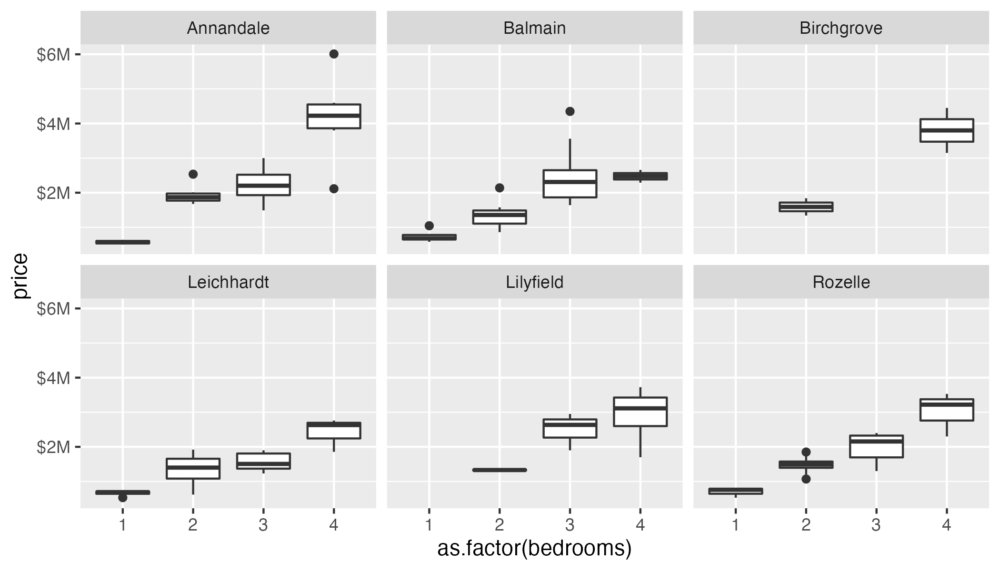

# allhomes

## Overview

This is the repository for the `allhomes` R package. The main function that the package provides is `get_past_sales_data()` which extracts past sales data from [allhomes.com.au](allhomes.com.au) for a (or multiple) suburb(s) and year(s).

## Details

The function `get_past_sales_data()` takes the following two arguments:

- `suburb`: This is a `character` vector denoting a (or multiple) suburbs. Every entry must be of the form "suburb_name, state/territory_abbreviation", e.g. "Balmain, NSW".
- `year`: This is an `numeric` or `integer` vector of the the year(s) of the sales history.

Under the hood, the function `get_past_sales_data()` first calls a helper function that determines for every `suburb` entry the Allhomes "division" name and ID. These identifiers are then used to extract past sales data from the Allhomes website.

Currently, there are limited sanity checks in place to verify if past sales data are available for a particular suburb and year. Allhomes does not have data for all suburbs and years.

`allhomes` also provides two datasets `divisions_ACT` and `divisions_NSW` that list division names and IDs for all Allhomes divisions (suburbs) in the ACT and NSW, respectively.

## Example

### Three North Canberra suburbs

```r
library(tidyverse)
library(allhomes)

# Get data for three ACT suburbs from the last 5 years 
suburbs <- c("Watson, ACT", "Ainslie, ACT", "Downer, ACT")
years <- 2018L:2022L
data <- get_past_sales_data(suburbs, years)

# Plot
data %>%
    filter(!is.na(bedrooms), bedrooms > 0, price > 0) %>%
    ggplot(aes(as.factor(bedrooms), price)) +
    geom_boxplot() +
    scale_y_continuous(
        labels = scales::label_dollar(scale = 1e-6, suffix = "M")) +
    facet_wrap(~ division)

ggsave("example_ACT.png", height = 4, width = 7)
```


### Sydney Leichhardt suburbs in 2021

```r
library(tidyverse)
library(allhomes)

# Get data for Leichhard suburbs
suburbs <- divisions_NSW %>%
    filter(sa3_name_2016 == "Leichhardt") %>%
    unite(suburb, division, state, sep = ", ") %>%
    pull(suburb)
years <- 2021L
data <- get_past_sales_data(suburbs, years)

# Plot
data %>%
    filter(!is.na(bedrooms), bedrooms > 0, price > 0) %>%
    ggplot(aes(as.factor(bedrooms), price)) +
    geom_boxplot() +
    scale_y_continuous(
        labels = scales::label_dollar(scale = 1e-6, suffix = "M")) +
    facet_wrap(~ division)

ggsave("example_NSW.png", height = 4, width = 7)
```




```
## Further comments

### Allhomes localities

The Allhomes API distinguishes between different types of "localities"; in increasing level of granularity there are: state > region > district > division > street > address.


### Allhomes past sales data

Allhomes (which is part of [Domain Group](https://en.wikipedia.org/wiki/Domain_Group)) receives historical past sales data from relevant state departments. Some details on Allhomes' data retention are given [here](https://help.allhomes.com.au/hc/en-us/articles/360055268773-Removal-of-historical-sales-data).

Allhomes past sale data are stored in fairly awkwardly-formatted HTML tables. Data for every sale is stored within a `<tbody>` element; within every `<tbody>` element, individual values (address, price, dates, block size, etc.) are spread across 3 lines, each contained within a `<td>` element; unfortunately, the format of every line is not consistent.

There are two different approaches to parsing the data: (1) We can make no assumptions about the column names and structure and infer this from splitting/parsing data by looking for key fields; this requires sanity checks to ensure that data are consistent; or (2) we can assume a specific column structure with specific column names, and then extract data conditional on this data structure. The advantage of (1) is that parsing the data should still work even if allhomes were to change the structure; however, this approach is computationally slow. The advantage of (2) is speed, at the risk of catastrophic failure should allhomes change the format of their past sales data tables. Currently, `get_past_sales_data()` uses approach (2).


## Disclaimer

This project is neither related to nor endorsed by [allhomes.com.au](allhomes.com.au). With changes to how Allhomes (and Domain group) manages and formats data, some or all of the functions might break at any time.

All data provided are subject to the [allhomes Advertising Sales Agreement terms and conditions](https://www.allhomes.com.au/ah/advertising-terms/).
