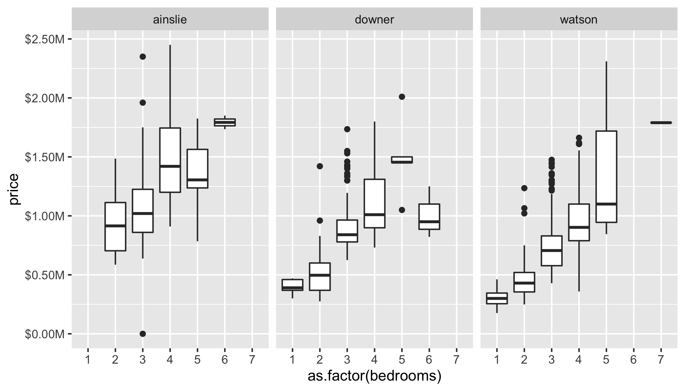

# allhomes

## Overview

This is the repository for the `allhomes` R package. At this point in time, the package provides a single function `get_past_sales_data()` which extracts past sales data from [allhomes.com.au](allhomes.com.au) for a particular suburb and year.

## Details

The function `get_past_sales_data()` takes the following three arguments:

- `suburb`: This is the name of the suburb as used in the URL. Examples are: `"ainslee"`, `"tuggeranong"`, `"watson"`. Generally a whitespace and apostrophe are replaced with a hyphen: `"red-hill"`, `"denman-prospect"`, `"o-connor"`, `"o-malley"`.
- `id`: This is the locality ID. Unfortunately there is no easy way to obtain the unique mapping from suburb to locality ID through allhomes; yo find out the locality ID for a suburb
    1. go to [allhomes > Research > Property & Past Sales](https://www.allhomes.com.au/ah/research/property-and-past-sales) and search for a suburb (e.g. Downer),
    2. select the appropriate result from the dynamic search result list
    3. identify the locality ID from the ULR (e.g. for Downer, the URL becomes "allhomes.com.au/ah/research/property-and-past-sales?localityId=14595&localityType=divisionIds&legalSs=&ss=Downer", and the locality ID is 14595)
- `year`: This is the year of the sales history.

To make life a bit easier (and as a proof of concept), `allhomes` provides a `localities_act` dataset that lists locality IDs for all ACT suburbs. Extending this dataset to include suburbs in other cities and states is on the todo list.

## Example

```r
library(tidyverse)
library(allhomes)
Í
# Get data for three suburbs from the last 5 years 
data <- localities_act %>%
    filter(locality %in% c("Watson", "Ainslie", "Downer")) %>%
    mutate(sales_data = map2(
        locality_ah_name,
        locality_ah_id,
        ~ map_dfr(
            2018:2022,
            function(year) get_past_sales_data(.x, .y, year))))

# Plot
data %>%
    pull(sales_data) %>%
    bind_rows() %>%
    filter(!is.na(bedrooms), bedrooms > 0, price > 0) %>%
    ggplot(aes(as.factor(bedrooms), price)) +
    geom_boxplot() +
    scale_y_continuous(
        labels = scales::label_dollar(scale = 1e-6, suffix = "M")) +
    facet_wrap(~ locality)

ggsave("example.png", height = 4, width = 7)
```



## Further comments

### Allhomes locality IDs

I haven't found an automated way to obtain locality IDs for a specific suburb. This is because the website uses Javascript to show search results, and the user *must* select the appropriate result from the dynamic search result list. It should be possible with `RSelenium` to loop through all suburbs, select the top search result, and then extract the locality ID from the URL. Currently this is on the todo list.

### Allhomes past sales data

Allhomes past sale data are stored in fairly awkward;y-formatted HTML tables. Data for every sale is stored within a `<tbody>` element; within every `<tbody>` element, individual values (address, price, dates, block size, etc.) are spread across 3 lines, each contained within a `<td>` element; unfortunately, the format of every line is not consistent.

There are two different approaches to parsing the data: (1) We can make no assumptions about the column names and structure and infer this from splitting/parsing data by looking for key fields; this requires sanity checks to ensure that data are consistent; or (2) we can assume a specific column structure with specific column names, and then extract data conditional on this data structure. The advantage of (1) is that parsing the data should still work even if allhomes were to change the structure; however, this approach is computationally slow. The advantage of (2) is speed, at the risk of catastrophic failure should allhomes change the format of their past sales data tables. Currently, `get_past_sales_data()` uses approach (2).
