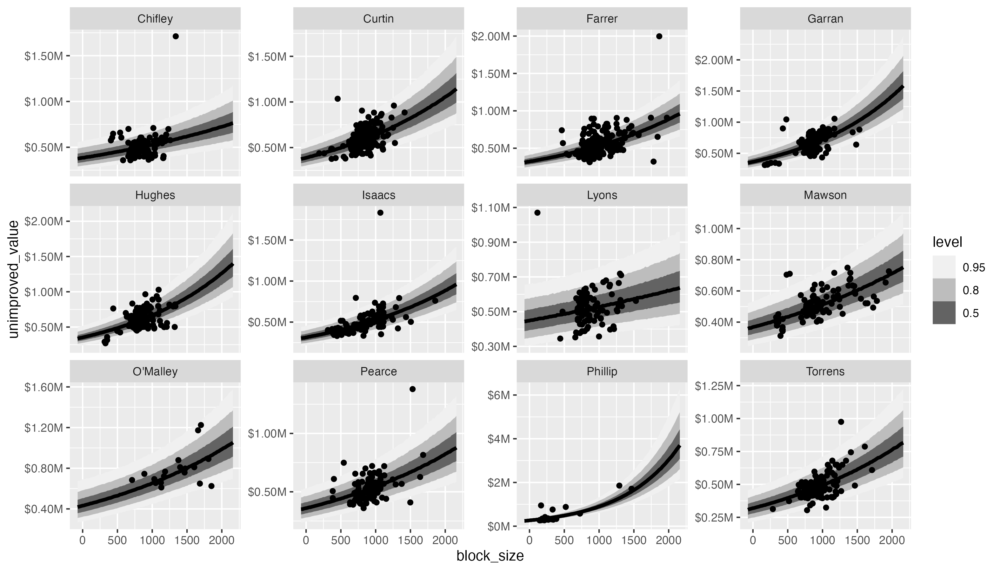

# allhomes

## Overview

This is the repository for the `allhomes` R package. The main function that the package provides is `get_past_sales_data()` which extracts past sales data from [allhomes.com.au](allhomes.com.au) for a (or multiple) suburb(s) and year(s).

## Details

The function `get_past_sales_data()` takes the following two arguments:

- `suburb`: This is a `character` vector denoting a (or multiple) suburbs. Every entry must be of the form "suburb_name, state/territory_abbreviation", e.g. "Balmain, NSW".
- `year`: This is an `numeric` or `integer` vector of the the year(s) of the sales history.

Example:

```r
get_past_sales_data("Balmain, NSW", 2019) %>% print(width = 100)
#[2022-07-27 14:52:47] Looking up division ID for suburb='Balmain, NSW'...
#[2022-07-27 14:52:47] URL: https://www.allhomes.com.au/svc/locality/searchallbyname?st=NSW&n=balmain
#[2022-07-27 14:52:47] Finding data for ID=7857, year=2019...
#[2022-07-27 14:52:47] URL: https://www.allhomes.com.au/ah/research/_/120785712/sale-history?year=2019
#[2022-07-27 14:52:48] Found 229 entries.
## A tibble: 229 × 27
#   divis…¹ state postc…² value  year address bedro…³ bathr…⁴ ensui…⁵ garages carpo…⁶ contr…⁷ trans…⁸
#   <chr>   <chr> <chr>   <int> <dbl> <chr>     <dbl>   <dbl> <lgl>     <dbl> <lgl>   <chr>   <chr>  
# 1 Balmain NSW   2041     7857  2019 1 Long…      NA      NA NA           NA NA      06/12/… 02/04/…
# 2 Balmain NSW   2041     7857  2019 7 Alex…      NA      NA NA           NA NA      30/08/… 16/10/…
# 3 Balmain NSW   2041     7857  2019 29 Bir…      NA      NA NA           NA NA      25/10/… 06/12/…
# 4 Balmain NSW   2041     7857  2019 2 Well…       6       3 NA            4 NA      25/05/… 26/08/…
# 5 Balmain NSW   2041     7857  2019 109 Mo…       4       2 NA            2 NA      25/02/… 08/04/…
# 6 Balmain NSW   2041     7857  2019 10 Tha…       4       2 NA            4 NA      05/10/… 16/12/…
# 7 Balmain NSW   2041     7857  2019 3/100 …      NA      NA NA           NA NA      18/07/… 06/09/…
# 8 Balmain NSW   2041     7857  2019 160 Be…       5       4 NA            1 NA      18/10/… 13/12/…
# 9 Balmain NSW   2041     7857  2019 25 Isa…      NA      NA NA           NA NA      01/05/… 02/09/…
#10 Balmain NSW   2041     7857  2019 71 Mor…       4       2 NA            2 NA      24/05/… 05/07/…
## … with 219 more rows, 14 more variables: list_date <chr>, price <dbl>, block_size <dbl>,
##   transfer_type <chr>, full_sale_price <dbl>, days_on_market <dbl>, sale_type <lgl>,
##   sale_record_source <chr>, building_size <lgl>, land_type <lgl>, property_type <lgl>,
##   purpose <chr>, unimproved_value <lgl>, unimproved_value_ratio <lgl>, and abbreviated variable
##   names ¹​division, ²​postcode, ³​bedrooms, ⁴​bathrooms, ⁵​ensuites, ⁶​carports, ⁷​contract_date,
##   ⁸​transfer_date
## ℹ Use `print(n = ...)` to see more rows, and `colnames()` to see all variable names
```

Under the hood, the function `get_past_sales_data()` first calls a helper function that determines for every `suburb` entry the Allhomes "division" name and ID. The division ID is then used to extract past sales data from the Allhomes website.

Currently, there are limited sanity checks in place to verify if past sales data are available for a particular suburb and year. Allhomes does not have data for all suburbs and years.

`allhomes` also provides two datasets `divisions_ACT` and `divisions_NSW` that list division names and IDs for all Allhomes divisions (suburbs) in the ACT and NSW, respectively.


## Example use cases

### Price as a function of the no. of bedrooms across three North Canberra suburbs

We show the distribution of sale prices as a function of the number of bedrooms
across three northern Canberra suburbs based on sales over the last 5 years.

```r
library(tidyverse)
library(allhomes)

# Get data for three ACT suburbs from the last 5 years 
suburbs <- c("Watson, ACT", "Ainslie, ACT", "Downer, ACT")
years <- 2018L:2022L
data <- get_past_sales_data(suburbs, years)

# Plot
data %>%
    filter(!is.na(bedrooms), bedrooms > 0, price > 0) %>%
    ggplot(aes(as.factor(bedrooms), price)) +
    geom_boxplot() +
    scale_y_continuous(
        labels = scales::label_dollar(scale = 1e-6, suffix = "M")) +
    facet_wrap(~ division)

ggsave("example_ACT.png", height = 4, width = 7)
```


### Median sale price across Sydney Leichhardt suburbs in 2021

We show the distribution and median value of sale prices of properties across
different suburbs in the Sydney Leichhardt area in 2021.

```r
library(tidyverse)
library(allhomes)

# Get data for Leichhard suburbs
suburbs <- divisions_NSW %>%
    filter(sa3_name_2016 == "Leichhardt") %>%
    unite(suburb, division, state, sep = ", ") %>%
    pull(suburb)
years <- 2021L
data <- get_past_sales_data(suburbs, years)

# Plot
library(ggbeeswarm)
data %>%
    filter(!is.na(price), price > 1e3) %>%
    ggplot(aes(division, price)) +
    geom_quasirandom() +
    stat_summary(fun = median, geom = "crossbar", lwd = 0.5) +
    scale_y_continuous(
        labels = scales::label_dollar(scale = 1e-6, suffix = "M"))

ggsave("example_NSW.png", height = 4, width = 7)
```


## Modelling unimproved value in the Woden Valley

The idea is to model the unimproved value (UV) of sold properties as a function of
block size and over time. 

We first get past sales data from the last 5 years for all suburbs in the Woden
valley.

```r
data <- get_past_sales_data(
    divisions_ACT %>%
        filter(sa3_name_2016 == "Woden Valley") %>%
        unite(suburb, division, state, sep = ", ") %>%
        pull(suburb),
    2017L:2020L)
```

We then keep those records where we have data for the UV and block size (i.e. we
omit records where any of these fields are `NA`) and further limit block sizes
to less than 2000 sqm and UVs to less than 2 million dollars (this is to exclude
large commercial purchases).

```r
data_model <- data %>%
    select(division, unimproved_value, block_size, year) %>%
    filter(
        if_all(everything(), ~ !is.na(.x) & .x > 0),
        block_size < 2000, unimproved_value < 2e6)
```

We'll now use `rstanarm` to fit a random effect model using full Bayesian 
inference; to do this, we assume that the division (suburb) is the random effect
and that the effects that the block size and year have on the log-transformed UV
vary by division (suburb). In other words, we have fixed and random effect components
to both the intercept and slopes


where $b$ is the block size, and $t$ the year.

```r
library(rstanarm)
options(mc.cores = 2)    # Adjust to reflect your specs
model <- stan_glmer(
    log(unimproved_value) ~ 1 + year + block_size + (1 + year + block_size | division),
    data = data_model)
```

We can visualise predictions from the posterior predictive for every division.

```r
library(tidybayes)
library(modelr)
data_model %>%
    data_grid(
        division,
        block_size = seq_range(block_size, n = 100, expand = 0.2),
        year) %>%
    add_predicted_draws(model) %>%
    ungroup() %>%
    ggplot(aes(block_size, unimproved_value)) +
    stat_lineribbon(aes(y = exp(.prediction))) +
    geom_point(data = data_model) +
    scale_y_continuous(labels = scales::label_dollar(scale = 1e-6, suffix = "M")) +
    facet_wrap(~ division, scale = "free_y") +
    scale_fill_brewer(palette = "Greys")

ggsave("example_UV_model.png", height = 6, width = 10.5)
```



We also predict the UV (including upper and lower 80% uncertainty bands) in
hundred thousands for a  specific suburb ("Curtin") and block size 
(900 sqm) over a period of 10 years.

```r
data_model %>%
    data_grid(
        division = "Curtin",
        block_size = 900,
        year = 2017:2026) %>%
    add_predicted_draws(model) %>%
    group_by(division, block_size, year) %>%
    summarise(
        val = quantile(exp(.prediction), probs = c(0.1, 0.5, 0.9)),
        probs = c("l", "m", "h"),
        .groups = "drop") %>%
    pivot_wider(names_from = probs, values_from = val) %>%
    mutate(across(c(l, m, h), ~ round(.x / 1e3)))
## A tibble: 10 × 6
#   division block_size  year     l     m     h
#   <chr>         <dbl> <int> <dbl> <dbl> <dbl>
# 1 Curtin          900  2017   466   587   744
# 2 Curtin          900  2018   477   603   758
# 3 Curtin          900  2019   487   615   774
# 4 Curtin          900  2020   501   635   802
# 5 Curtin          900  2021   513   649   818
# 6 Curtin          900  2022   524   660   837
# 7 Curtin          900  2023   538   682   861
# 8 Curtin          900  2024   550   699   881
# 9 Curtin          900  2025   558   710   903
#10 Curtin          900  2026   576   730   929
```

## Further comments

### Allhomes localities

The Allhomes API distinguishes between different types of "localities"; in increasing level of granularity there are: state > region > district > division > street > address. Regions seem to coincide with Statistical Regions (SRs)


### Allhomes past sales data

Allhomes (which is part of [Domain Group](https://en.wikipedia.org/wiki/Domain_Group)) receives historical past sales data from relevant state departments. Some details on Allhomes' data retention are given [here](https://help.allhomes.com.au/hc/en-us/articles/360055268773-Removal-of-historical-sales-data).

Allhomes past sale data are stored in fairly awkwardly-formatted HTML tables. Data for every sale is stored within a `<tbody>` element; within every `<tbody>` element, individual values (address, price, dates, block size, etc.) are spread across 3 lines, each contained within a `<td>` element; unfortunately, the format of every line is not consistent.

There are two different approaches to parsing the data: (1) We can make no assumptions about the column names and structure and infer this from splitting/parsing data by looking for key fields; this requires sanity checks to ensure that data are consistent; or (2) we can assume a specific column structure with specific column names, and then extract data conditional on this data structure. The advantage of (1) is that parsing the data should still work even if allhomes were to change the structure; however, this approach is computationally slow. The advantage of (2) is speed, at the risk of catastrophic failure should allhomes change the format of their past sales data tables. Currently, `get_past_sales_data()` uses approach (2).


## Disclaimer

This project is neither related to nor endorsed by [allhomes.com.au](allhomes.com.au). With changes to how Allhomes (and Domain group) manages and formats data, some or all of the functions might break at any time.

All data provided are subject to the [allhomes Advertising Sales Agreement terms and conditions](https://www.allhomes.com.au/ah/advertising-terms/).
