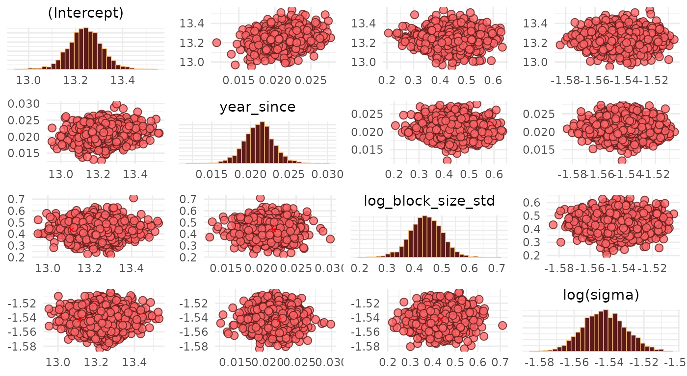
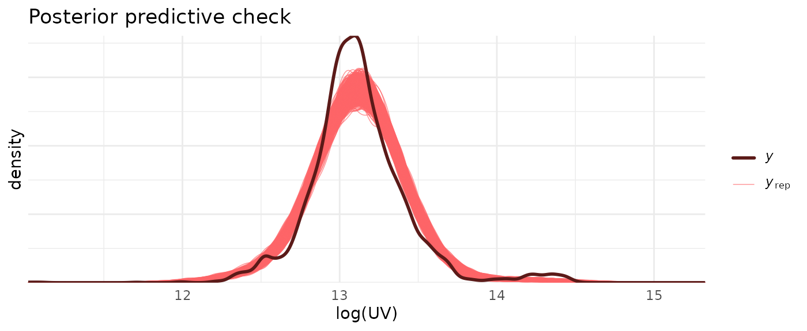
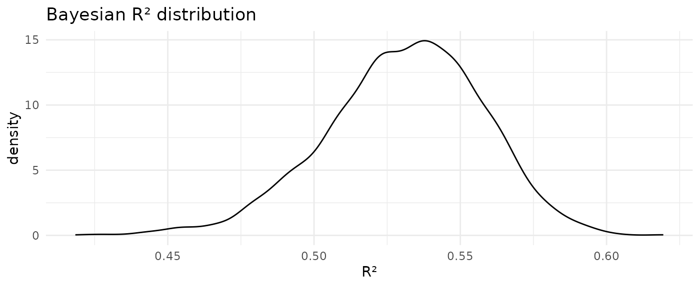
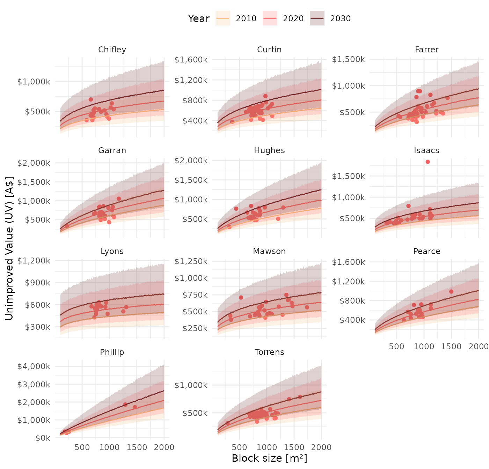

# Modelling the unimproved value in the ACT's Woden Valley

## Goal

The goal of this case study is to show how to use
[`allhomes`](https://github.com/mevers/allhomes) to pull in past sales
data for various ACT suburbs and then fit a mixed-effect model using
Stan to predict the unimproved value (UV, i.e. the value of the plot of
land itself) as a function of the block size (in square-meters), the
year of the sale and the suburb. We then explore the output of the model
and interpret its results.

Taking inspiration from examples & modelling discussions given in
[Gelman, Hill and Vehtari, Regression and Other
Stories](https://avehtari.github.io/ROS-Examples/), this case study also
serves as an example of how to fit a mixed-effect model to real-world
data and interpret results; as will become clear, the model fit is not
particularly good in the sense that a lot of the observed variability
remains unexplained by the model’s input variables. However, the case
study is useful in the context of exploring model results and different
aspects of the model fit, and represents the kind of analysis one might
perform when exploring a new real-world dataset.

## Prerequisities

We load necessary non-base R libraries, optimise the use of multiple
cores for running the `rstanarm` model, and define a colour palette
based on the nice
[`wesanderson`](https://github.com/karthik/wesanderson) package.

``` r
library(allhomes)
library(tidyverse)
library(rstanarm)
library(bayesplot)
library(tidybayes)
library(modelr)
library(wesanderson)
library(plotly)
options(mc.cores = parallel::detectCores())
pal <- wes_palette("GrandBudapest1", n = 3)
```

## Raw data

We get past sales for all suburbs in ACT’s Woden Valley from the last 10
years. This is easily done by using the
[`allhomes::divisions_ACT`](https://mevers.github.io/allhomes/reference/divisions_ACT.md)
dataset, and then filter divisions (i.e. suburbs) based on their
corresponding [SA3
regions](https://www.abs.gov.au/ausstats/abs@.nsf/Lookup/by%20Subject/1270.0.55.001~July%202016~Main%20Features~Statistical%20Area%20Level%203%20(SA3)~10015).

``` r
suburbs <- divisions_ACT |>
        filter(sa3_name_2016 == "Woden Valley") |>
        unite(suburb, division, state, sep = ", ") |>
        pull(suburb)
data <- suburbs |> 
    map_dfr(function(burb) 
        map_dfr(2011L:2020L, function(yr) get_past_sales_data(burb, yr)))
#> Warning in get_past_sales_data(burb, yr): No sales data for suburb 'O'Malley,
#> ACT'
#> Warning in get_past_sales_data(burb, yr): No sales data for suburb 'O'Malley,
#> ACT'
#> Warning in get_past_sales_data(burb, yr): No sales data for suburb 'O'Malley,
#> ACT'
#> Warning in get_past_sales_data(burb, yr): No sales data for suburb 'O'Malley,
#> ACT'
#> Warning in get_past_sales_data(burb, yr): No sales data for suburb 'O'Malley,
#> ACT'
#> Warning in get_past_sales_data(burb, yr): No sales data for suburb 'O'Malley,
#> ACT'
#> Warning in get_past_sales_data(burb, yr): No sales data for suburb 'O'Malley,
#> ACT'
#> Warning in get_past_sales_data(burb, yr): No sales data for suburb 'O'Malley,
#> ACT'
#> Warning in get_past_sales_data(burb, yr): No sales data for suburb 'O'Malley,
#> ACT'
#> Warning in get_past_sales_data(burb, yr): No sales data for suburb 'O'Malley,
#> ACT'
#> Warning in get_past_sales_data(burb, yr): No sales data for suburb 'Swinger
#> Hill, ACT'
#> Warning in get_past_sales_data(burb, yr): No sales data for suburb 'Swinger
#> Hill, ACT'
#> Warning in get_past_sales_data(burb, yr): No sales data for suburb 'Swinger
#> Hill, ACT'
#> Warning in get_past_sales_data(burb, yr): No sales data for suburb 'Swinger
#> Hill, ACT'
#> Warning in get_past_sales_data(burb, yr): No sales data for suburb 'Swinger
#> Hill, ACT'
#> Warning in get_past_sales_data(burb, yr): No sales data for suburb 'Swinger
#> Hill, ACT'
#> Warning in get_past_sales_data(burb, yr): No sales data for suburb 'Swinger
#> Hill, ACT'
#> Warning in get_past_sales_data(burb, yr): No sales data for suburb 'Swinger
#> Hill, ACT'
#> Warning in get_past_sales_data(burb, yr): No sales data for suburb 'Swinger
#> Hill, ACT'
#> Warning in get_past_sales_data(burb, yr): No sales data for suburb 'Swinger
#> Hill, ACT'
```

## Data processing

Since we want to build a predictive model that allows us to estimate the
residential unimproved value (UV) of a property based on its block size
and location, we keep only those records where we have data for the UV
and block size (i.e. we omit records where any of these fields are `NA`)
and further limit block sizes to less than 2000 sqm and UVs to less than
2 million dollars (this is to exclude large commercial purchases).

``` r
data_model <- data |>
    mutate(year = as.integer(year(contract_date))) |>
    select(division, unimproved_value, block_size, year) |>
    filter(
        if_all(everything(), ~ !is.na(.x) & .x > 0),
        block_size < 2000, unimproved_value < 2e6) %>%
    # Variable transformations
    mutate(
        # Year since 2019
        year_since = year - 2019L,
        # log-transformed UV
        log_UV = log(unimproved_value),
        # log-transformed block_size, standardised to the log of median value
        log_block_size_std = log(block_size) - log(850))
data_model
#> # A tibble: 3,439 × 7
#>    division unimproved_value block_size  year year_since log_UV
#>    <chr>               <int>      <int> <int>      <int>  <dbl>
#>  1 Chifley            360000        853  2011         -8   12.8
#>  2 Chifley            444000       1048  2011         -8   13.0
#>  3 Chifley            359000        695  2011         -8   12.8
#>  4 Chifley            341000        822  2011         -8   12.7
#>  5 Chifley            451000        760  2011         -8   13.0
#>  6 Chifley            410000        845  2011         -8   12.9
#>  7 Chifley            450000       1330  2011         -8   13.0
#>  8 Chifley            382000        857  2011         -8   12.9
#>  9 Chifley            366000       1020  2011         -8   12.8
#> 10 Chifley            486000        990  2011         -8   13.1
#> # ℹ 3,429 more rows
#> # ℹ 1 more variable: log_block_size_std <dbl>
```

## Fitting the model

### Model formulation

We now use `rstanarm` to fit a model using full Bayesian inference in
Stan. We assume that the effects that the log-transformed block size and
the (shifted) year have on the log-transformed UV vary by division
(i.e. suburb). To model this, we consider a fixed and a random effect
component to both the overall intercept and predictor coefficient
estimates: The fixed effects characterise the effects that are *common
across divisions*, and the random effects are expressed as deviations
from the fixed effects that *vary across divisions*.

Written out, the model takes the following form

$$\begin{aligned}
{\mathtt{l}\mathtt{o}\mathtt{g}\mathtt{\_}\mathtt{U}\mathtt{V}} & {\sim N(\mu,\sigma)} \\
\mu & {= \mu_{\alpha} + \alpha_{\lbrack i\rbrack} + \left( \mu_{\beta_{1}} + \beta_{1,{\lbrack i\rbrack}} \right){\mathtt{y}\mathtt{e}\mathtt{a}\mathtt{r}\mathtt{\_}\mathtt{s}\mathtt{i}\mathtt{n}\mathtt{c}\mathtt{e}} + \left( \mu_{\beta_{2}} + \beta_{2,{\lbrack i\rbrack}} \right){\mathtt{l}\mathtt{o}\mathtt{g}\mathtt{\_}\mathtt{b}\mathtt{l}\mathtt{o}\mathtt{c}\mathtt{k}\mathtt{\_}\mathtt{s}\mathtt{i}\mathtt{z}\mathtt{e}\mathtt{\_}\mathtt{s}\mathtt{t}\mathtt{d}}} \\
 & 
\end{aligned}$$

where $$\begin{aligned}
{\mathtt{y}\mathtt{e}\mathtt{a}\mathtt{r}\mathtt{\_}\mathtt{s}\mathtt{i}\mathtt{n}\mathtt{c}\mathtt{e}} & {= {\mathtt{y}\mathtt{e}\mathtt{a}\mathtt{r}} - 2019\,,} \\
{\mathtt{l}\mathtt{o}\mathtt{g}\mathtt{\_}\mathtt{b}\mathtt{l}\mathtt{o}\mathtt{c}\mathtt{k}\mathtt{\_}\mathtt{s}\mathtt{i}\mathtt{z}\mathtt{e}\mathtt{\_}\mathtt{s}\mathtt{t}\mathtt{d}} & {= \log\left( {\mathtt{b}\mathtt{l}\mathtt{o}\mathtt{c}\mathtt{k}\mathtt{\_}\mathtt{s}\mathtt{i}\mathtt{z}\mathtt{e}} \right) - \log(850)\,.}
\end{aligned}$$ Such a model is motivated by the assumption that
estimates characterising the change in log-transformed UV are expected
to have a fixed component and a random suburb-dependent component. In
other words division-level estimates are expected to be normally
distributed around a mean value, i.e. the fixed effect. Using division
as a random (rather than fixed) effect allows for partial pooling of
observations across divisions when estimating division-level effects.

The reason for the particular variable transformations are summarised in
the following bullet points:

- `year_since` is the shifted `year` such that `year_since = 0`
  corresponds to 2019. In other words, 2019 was arbitrarily chosen as
  the reference year.

- `log_block_size_std` is the log-transformed and then shifted block
  size; we log-transform values since the block size cannot become
  negative; shifting the log-transformed values means that
  `log_block_size_std = 0` corresponds to a block size of 850 $m^{2}$,
  which is roughly the median block size value across all past sale
  records.

Chapter 12 of [Gelman, Hill and Vehtari, Regression and Other
Stories](https://avehtari.github.io/ROS-Examples/) has a great
discussion and examples on variable transformations and what would
motivate them.

We fit the model using standard `lmer`/`lme4`-syntax in Stan using
[`rstanarm::stan_glmer()`](https://mc-stan.org/rstanarm/reference/stan_glmer.html).

``` r
model <- stan_glmer(
    log_UV ~ 1 + year_since + log_block_size_std + (1 + year_since + log_block_size_std | division),
    data = data_model)
```

### Model diagnostics

We inspect pairwise correlations between the fixed-effect parameter
estimates in bivariate scatter plots. This is useful for identifying
divergencies, collinearities and multiplicative non-identifiabilities.

``` r
bayesplot_theme_set(theme_minimal())
color_scheme_set(scheme = c(pal, pal))
pairs(
    model, 
    pars = c("(Intercept)", "year_since", "log_block_size_std", "sigma"),
    transformations = list(sigma = "log"))
```



We note that there are no divergent transitions, and the Gaussian
blobs/clouds suggest that there are no major issues with our estimates
(see [Visual MCMC diagnostics using the bayesplot
package](https://cran.r-project.org/web/packages/bayesplot/vignettes/visual-mcmc-diagnostics.html)
for a lot more details on MCMC diagnostics).

Next, we compare samples drawn from the posterior predictive
distribution with
$\mathtt{l}\mathtt{o}\mathtt{g}\mathtt{\_}\mathtt{U}\mathtt{V}$ values,
and show the distribution of [leave-one-out (LOO)-adjusted
R-squared](http://www.stat.columbia.edu/~gelman/research/published/bayes_R2_v3.pdf)
values $R_{s}^{2}$.

``` r
ppc_dens_overlay(data_model$log_UV, posterior_predict(model)) +
    labs(
        x = "log(UV)",
        y = "density",
        title = "Posterior predictive check")
loo_r2 <- loo_R2(model)
#> Warning: Some Pareto k diagnostic values are too high. See help('pareto-k-diagnostic') for details.
loo_r2 %>%
    enframe() %>%
    ggplot(aes(value)) +
    geom_density() + 
    theme_minimal() +
    labs(
        x = "R²",
        y = "density",
        title = "Bayesian R² distribution")
```



The posterior predictive check suggests some issues with the model fit.
Of note, the actual
$\mathtt{l}\mathtt{o}\mathtt{g}\mathtt{\_}\mathtt{U}\mathtt{V}$
distribution shows a small bump at values $\log{UV} > 14$ (corresponding
to values greater than \$1.2 million) which is not reproduced by the
model. Instead these large UV values pull the mean of the posterior
predictive to a slightly larger value than that of the actual
distribution. The median Bayesian $R_{s}^{2}$ value of 0.53 also
indicates that this is not a great fit; or in other words: there is a
lot of unexplained (residual) variance.

## Model results

We show and interpret fixed and random-effect parameter estimates.
[`broom.mixed::tidy()`](https://generics.r-lib.org/reference/tidy.html)
makes it easy to extract estimates in a standardised format.

### Interpretation of fixed effect estimates

We show fixed parameter estimates (mean and standard deviation)
including 95% uncertainty estimates (based on the 2.5% and 97.5%
quantiles of the marginal posteriors).

``` r
effect_fixed <- broom.mixed::tidy(model, "fixed", conf.int = TRUE)
effect_fixed
#> # A tibble: 3 × 5
#>   term               estimate std.error conf.low conf.high
#>   <chr>                 <dbl>     <dbl>    <dbl>     <dbl>
#> 1 (Intercept)         13.2      0.0677   13.1      13.4   
#> 2 year_since           0.0211   0.00178   0.0179    0.0243
#> 3 log_block_size_std   0.442    0.0573    0.345     0.536
```

- The intercept estimate is $\mu_{\alpha}$ = 13.2. This means that the
  estimated fixed-effect UV in 2019 of a block the size of 850 $m^{2}$
  is approximately $\exp\left( \mu_{\alpha} \right)$ = \$562.9k.

- The coefficient estimate for `year_since` of $\mu_{\beta_{1}}$ =
  0.0211 means that the fixed-effect UV of a block the size of 850
  $m^{2}$ increases every year by a factor of
  $\exp\left( \mu_{\beta_{1}} \right)$ = 1.02, i.e. by around 2%.

- The coefficient estimate for `log_block_size_std` of $\mu_{\beta_{2}}$
  = 0.442 means that a 10% increase in block size in 2019 translated
  into a $\exp\left( \mu_{\beta_{2}}\log(1.1) \right)$ = 1.04 factor
  increase in the UV, i.e. a 4% increase (in the UV).

We can compare fixed-effect estimates from the mixed-effect model with
those from a complete pooling model, i.e. a model where we ignore any
division-level differences.

``` r
model_complete_pooling <- stan_glm(
    log_UV ~ 1 + year_since + log_block_size_std,
    data = data_model)
broom::tidy(model_complete_pooling, "fixed", conf.int = TRUE)
```

We note the wider uncertainty intervals in the fixed-effect estimates of
the mixed-effect model, which are probably more realistic given the
variability in division-level effects.

### Interpretation of random effect estimates

Random-effect estimates are shown as standard deviations of the
underlying (normal) distributions and correlation coefficients of the
covariance matrix. The following table summarises those estimates
including the residual standard deviation $\sigma$.

``` r
effect_random <- broom.mixed::tidy(model, "ran_pars", conf.int = TRUE)
effect_random
#> # A tibble: 7 × 3
#>   term                                        group     estimate
#>   <chr>                                       <chr>        <dbl>
#> 1 sd_(Intercept).division                     division  0.241   
#> 2 sd_year_since.division                      division  0.00457 
#> 3 sd_log_block_size_std.division              division  0.186   
#> 4 cor_(Intercept).year_since.division         division  0.158   
#> 5 cor_(Intercept).log_block_size_std.division division  0.000631
#> 6 cor_year_since.log_block_size_std.division  division -0.000164
#> 7 sd_Observation.Residual                     Residual  0.214
```

- The standard deviation estimate for the random-effect intercept
  distribution of ${sd}\left( \alpha_{\lbrack i\rbrack} \right)$ = 0.241
  means that 68% of properties (in 2019 with a block size of 850
  $m^{2}$) across all divisions have a UV in the range of
  $\left\lbrack \mu_{\alpha} - {sd}\left( \alpha_{\lbrack i\rbrack} \right),\mu_{\alpha} + {sd}\left( \alpha_{\lbrack i\rbrack} \right) \right\rbrack$
  = \[\$442.5k, \$716.2k\].

- The standard deviation estimate for the random-effect component of the
  `year_since` effect is
  ${sd}\left( \beta_{1,{\lbrack i\rbrack}} \right)$ = 0.00457; this
  means that the per-year UV increase of 68% of properties (with a block
  size of 850 $m^{2}$) across all divisions is in the range of
  $\left\lbrack \mu_{\beta_{1}} - {sd}\left( \beta_{1,{\lbrack i\rbrack}} \right),\mu_{\beta_{1}} + {sd}\left( \beta_{1,{\lbrack i\rbrack}} \right) \right\rbrack$
  = \[1.7%, 2.6%\].

- The standard deviation estimate for the random-effect component of the
  `log_block_size_std` effect is
  ${sd}\left( \beta_{2,{\lbrack i\rbrack}} \right)$ = 0.186; this means
  that a 10% increase in block size of 68% of properties across all
  divisions in 2019 translated into a UV increase in the range of
  \[2.5%, 6.2%\].

### Forecasts

We use the model to predict UV values across all Woden valley suburbs as
a function of block size and for every 5 years between 2010 and 2030 .
This is easy to do by using
[`modelr::data_grid()`](https://modelr.tidyverse.org/reference/data_grid.html)
to create a grid of values which are then used as input to the model;
[`tidybayes::add_predicted_draws()`](https://mjskay.github.io/tidybayes/reference/add_predicted_draws.html)
then draws samples from the posterior predictive distribution
conditional on the generated input data.

``` r
data_pred <- data_model %>%
    data_grid(
        division = unique(division),
        year_since = seq(2010L, 2030L, by = 5) - 2019L,
        log_block_size_std = log(seq(100, 2000, by = 10)) - log(850)) %>%
    add_predicted_draws(model) %>%
    group_by(division, year_since, log_block_size_std) %>%
    median_qi() %>%
    ungroup() %>%
    mutate(
        year = year_since + 2019L,
        block_size = exp(log_block_size_std + log(850)))
```

#### Dynamic visualisation

We now draw median and 95% quantile intervals of the UV predictions as a
function of block size for every division (suburb) and year. We use
[`plotly`](https://plotly.com/r/) to produce an interactive
visualisation, with details given on mouse-hover.

``` r
# Create nested data
data_pl <- data_pred %>%
    group_by(division) %>%
    nest() %>%
    ungroup()
# Silence warnings that originate from using `frame`
options(warn = -1)
# Create plotly subplots
map2(
    data_pl$division, data_pl$data,
    function(suburb, df) {
    df %>% 
        plot_ly(
            x = ~block_size, 
            frame = ~year,
            customdata = ~ sprintf(
                "<b>%s</b>, %i m²<br>Median UV: A$ %ik<br>95%% CI [%ik, %ik]<extra></extra>", 
                suburb, round(block_size),
                round(exp(.prediction) / 1e3),
                round(exp(.lower) / 1e3), round(exp(.upper) / 1e3)),
            height = 1000) %>%
        add_lines(
            y = ~exp(.prediction), 
            line = list(color = pal[1]),
            showlegend = FALSE,
            hovertemplate = "%{customdata}") %>%
        add_ribbons(
            ymin = ~exp(.lower), ymax = ~exp(.upper), 
            color = NA,
            fillcolor = pal[1],
            opacity = 0.2,
            showlegend = FALSE,
            hoverinfo = "none") %>%
        layout(
            yaxis = list(
                title = "",
                range = c(0, max(exp(df$.upper)))),
            xaxis = list(title = ""),
            annotations = list(list(
                x = 0.5, 
                y = 1, 
                text = suburb,
                xref = "paper",  
                yref = "paper",  
                xanchor = "center",  
                yanchor = "bottom",  
                showarrow = FALSE))
        ) 
    }) %>%
    subplot(
        nrows = 5, 
        shareX = TRUE) %>%
    layout(
        margin = list(t = 50, r = 10, t = 10, b = 10),
        xaxis = list(title = "Block size [m²]"),
        yaxis = list(title = "Unimproved Value (UV) [A$]")) %>%
    animation_button(visible = FALSE)
```

#### Static visualisation

We also show a static version for years 2010, 2020 and 2030, and include
recorded UV data from 2020 sales.

``` r
# Reset warning level to default
options(warn = 0)
data_pred %>%
    filter(year %in% c(2010, 2020, 2030)) %>%
    mutate(year = as.factor(year)) %>%
    ggplot(aes(block_size, exp(.prediction), colour = year, fill = year)) +
    geom_point(
        data = data_model %>% filter(year == 2020L), 
        aes(x = block_size, y = unimproved_value),
        colour = pal[2],
        inherit.aes = FALSE) +
    geom_line() + 
    geom_ribbon(aes(ymin = exp(.lower), ymax = exp(.upper)), colour = NA, alpha = 0.2) +
    facet_wrap(~ division, scales = "free_y", ncol = 3) +
    scale_fill_manual(values = pal) +
    scale_colour_manual(values = pal) +
    scale_y_continuous(
        labels=scales::dollar_format(accuracy = 1, scale = 1e-3, suffix = "k")) +
    theme_minimal() +
    labs(
        x = "Block size [m²]", y = "Unimproved Value (UV) [A$]", 
        fill = "Year", colour = "Year") +
    theme(legend.position = "top")
```



#### Observations

We note a few observations:

1.  Properties of block size 1000 $m^{2}$ have the **highest UV** in the
    suburbs Phillip, Swinger Hill and Garran in 2030.

        #> # A tibble: 3 × 6
        #>   division `2010` `2015` `2020` `2025` `2030`
        #>   <chr>    <chr>  <chr>  <chr>  <chr>  <chr> 
        #> 1 Phillip  $950k  $1070k $1190k $1340k $1500k
        #> 2 Garran   $608k  $670k  $736k  $805k  $889k 
        #> 3 Hughes   $536k  $604k  $679k  $761k  $857k

    Lyons, Mawson and Torrens properties of the same size are predicted
    to have the **lowest UV** om 2030.

        #> # A tibble: 3 × 6
        #>   division `2010` `2015` `2020` `2025` `2030`
        #>   <chr>    <chr>  <chr>  <chr>  <chr>  <chr> 
        #> 1 Farrer   $454k  $500k  $550k  $606k  $666k 
        #> 2 Mawson   $429k  $476k  $526k  $582k  $648k 
        #> 3 Torrens  $424k  $466k  $512k  $559k  $614k

2.  The suburbs Phillip, Swinger Hill and Hughes are predicted to show
    the **largest change in UV** in 2030 relative to 2025.

        #> # A tibble: 3 × 5
        #>   division `2015 - 2010` `2020 - 2015` `2025 - 2020` `2030 - 2025`
        #>   <chr>    <chr>         <chr>         <chr>         <chr>        
        #> 1 Phillip  $116k         $127k         $145k         $157k        
        #> 2 Hughes   $67.9k        $74.3k        $82.8k        $95.8k       
        #> 3 Curtin   $64.6k        $73.7k        $67.9k        $84.5k

    The suburbs Lyons, Mawson, and Pearce are predicted to show the
    **smallest change in UV** during that period.

        #> # A tibble: 3 × 5
        #>   division `2015 - 2010` `2020 - 2015` `2025 - 2020` `2030 - 2025`
        #>   <chr>    <chr>         <chr>         <chr>         <chr>        
        #> 1 Mawson   $46.9k        $50.2k        $56.5k        $66.1k       
        #> 2 Farrer   $45.7k        $50.5k        $55.8k        $59.6k       
        #> 3 Torrens  $41.7k        $46k          $46.6k        $55.5k
