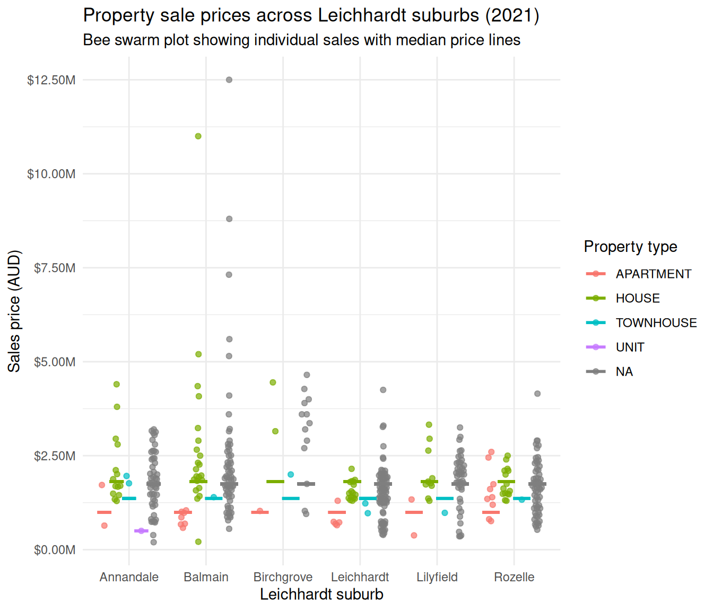

# Median sale prices across Sydney Leichhardt suburbs in 2021

## Introduction

This vignette demonstrates how to use the `allhomes` package to extract
and analyse historical property sales data from
[allhomes.com.au](https://www.allhomes.com.au). We’ll focus on exploring
median property sale prices across suburbs in the Sydney Leichhardt area
during 2021. By analysing sales data from multiple suburbs, we’ll create
visualisations to understand price distributions and identify patterns
in the local property market.

The `allhomes` package provides access to detailed sales data, including
property features, sale prices, and dates. This example shows how to
collect data for multiple suburbs, clean it, and perform basic
exploratory data analysis to understand median price variations.

## Setup

First, load the required packages. We’ll use `allhomes` for Allhomes
sales data extraction, `tidyverse` for data manipulation and
visualisation, and `ggbeeswarm` for creating bee swarm plots.

``` r
library(allhomes)
library(tidyverse)
library(ggbeeswarm)
```

## Data collection

The
[`get_past_sales_data()`](https://mevers.github.io/allhomes/reference/get_past_sales_data.md)
function retrieves sales data for a specific suburb and year. We’ll
collect data for all suburbs in the Leichhardt SA3 area using the
internal `divisions_NSW` dataset to identify the relevant suburbs.

``` r
# Get all Leichhardt suburbs
suburbs <- divisions_NSW |>
    filter(sa3_name_2016 == "Leichhardt") |>
    unite(suburb, division, state, sep = ", ") |>
    pull(suburb)

# Display the suburbs we're analysing
suburbs
#> [1] "Annandale, NSW"    "Balmain, NSW"      "Balmain East, NSW"
#> [4] "Birchgrove, NSW"   "Leichhardt, NSW"   "Lilyfield, NSW"   
#> [7] "Rozelle, NSW"

# Get data for Leichhardt suburbs
data <- suburbs |> map(get_past_sales_data, year = 2021L) |> bind_rows()
#> Warning in .f(.x[[i]], ...): No sales data for suburb 'Balmain East, NSW'
```

## Data exploration

Let’s examine the collected data. We’ll look at the total number of
sales, data completeness, and basic statistics by suburb and property
type.

``` r
# Summary statistics by suburb and property type
data_summary <- data %>%
    group_by(division, property_type) |>
    summarise(
        total_sales = n(),
        sales_with_price = sum(!is.na(price) & price > 0),
        median_price = median(price, na.rm = TRUE),
        mean_price = mean(price, na.rm = TRUE),
        .groups = "drop") |>
    arrange(division, property_type)

# Display summary table
data_summary |>
    knitr::kable(
        caption = "Summary of sales data by suburb and property type (2021)",
        digits = 0,
        format.args = list(big.mark = ","))
```

| division   | property_type | total_sales | sales_with_price | median_price | mean_price |
|:-----------|:--------------|------------:|-----------------:|-------------:|-----------:|
| Annandale  | APARTMENT     |          30 |                2 |    1,180,000 |  1,180,000 |
| Annandale  | HOUSE         |         108 |               14 |    1,787,500 |  2,185,000 |
| Annandale  | TOWNHOUSE     |          11 |                2 |    1,862,500 |  1,862,500 |
| Annandale  | UNIT          |           1 |                1 |      500,000 |    500,000 |
| Annandale  | NA            |          77 |               52 |    1,190,000 |  1,157,981 |
| Balmain    | APARTMENT     |          48 |                7 |      860,000 |    833,643 |
| Balmain    | HOUSE         |         126 |               22 |    2,056,000 |  2,738,455 |
| Balmain    | TOWNHOUSE     |           7 |                1 |    1,396,000 |  1,396,000 |
| Balmain    | NA            |          82 |               63 |    1,662,500 |  1,788,098 |
| Birchgrove | APARTMENT     |          11 |                1 |    1,030,000 |  1,030,000 |
| Birchgrove | HOUSE         |          40 |                2 |    3,800,000 |  3,800,000 |
| Birchgrove | TOWNHOUSE     |           5 |                1 |    2,000,000 |  2,000,000 |
| Birchgrove | NA            |          21 |               13 |    1,750,000 |  1,900,952 |
| Leichhardt | APARTMENT     |          55 |                5 |      725,000 |    820,000 |
| Leichhardt | HOUSE         |         171 |               16 |    1,505,000 |  1,582,156 |
| Leichhardt | LAND          |           1 |                0 |           NA |        NaN |
| Leichhardt | TOWNHOUSE     |          26 |                2 |    1,100,000 |  1,100,000 |
| Leichhardt | NA            |         107 |               79 |    1,265,000 |  1,103,242 |
| Lilyfield  | APARTMENT     |          12 |                2 |      857,500 |    857,500 |
| Lilyfield  | HOUSE         |          85 |               10 |    1,787,500 |  2,048,000 |
| Lilyfield  | TOWNHOUSE     |           6 |                1 |      979,000 |    979,000 |
| Lilyfield  | NA            |          64 |               42 |    1,475,000 |  1,206,052 |
| Rozelle    | APARTMENT     |          48 |                9 |    1,395,000 |  1,545,667 |
| Rozelle    | HOUSE         |         110 |               15 |    1,626,000 |  1,783,200 |
| Rozelle    | TOWNHOUSE     |           8 |                1 |    1,330,000 |  1,330,000 |
| Rozelle    | NA            |          78 |               60 |    1,314,250 |  1,255,769 |

Summary of sales data by suburb and property type (2021)

## Median price analysis

Now we’ll analyse the median sale prices across Leichhardt suburbs.
We’ll filter for valid data and create a visualisation showing price
distributions and median values for different property types.

``` r
# Prepare data for plotting
plot_data <- data |>
    filter(!is.na(price), price > 1e3) |>  # Remove invalid prices
    mutate(median_price = median(price), .by = property_type)  # Calculate median per property type

# Create bee swarm plot with median lines
plot_data |>
    ggplot(aes(division, price, colour = property_type)) +
    geom_quasirandom(dodge.width = 0.8, alpha = 0.7) +
    geom_errorbar(
        aes(ymin = median_price, ymax = median_price), 
        position = position_dodge(width = 0.8),
        linewidth = 1) +
    scale_y_continuous(
        labels = scales::label_dollar(scale = 1e-6, suffix = "M")) +
    labs(
        title = "Property sale prices across Leichhardt suburbs (2021)",
        subtitle = "Bee swarm plot showing individual sales with median price lines",
        x = "Leichhardt suburb", 
        y = "Sales price (AUD)",
        colour = "Property type") +
    theme_minimal()
```



## Insights

From the visualisation and data analysis, we can observe:

- **Price variation by suburb**: There are clear differences in median
  property prices between suburbs within the Leichhardt area, reflecting
  local market conditions and property characteristics.
- **Property type differences**: As expected, different property types
  (houses, units, etc.) show distinct price distributions, with houses
  generally resulting in higher prices.
- **Data considerations**: The bee swarm plot reveals the distribution
  of individual sales, while the horizontal lines show median prices for
  each property type across all suburbs.

This analysis provides a foundation for understanding the Leichhardt
property market in 2021. Potential extensions could include:

- Analysing price trends over multiple years
- Examining the relationship between price and property features
  (bedrooms, bathrooms, land size)
- Investigating seasonal patterns in sales
- Comparing Leichhardt prices with other Sydney areas
