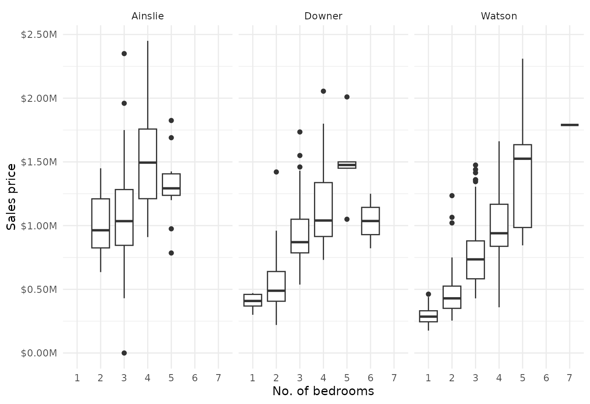

# Price as a function of the no. of bedrooms across three North Canberra suburbs

We load necessary non-base R libraries.

``` r
library(allhomes)
library(tidyverse)
```

Download past sales data for three northern Canberra suburbs from the
last 5 years.

``` r
# Get data for three ACT suburbs from the last 5 years 
suburbs <- c("Watson, ACT", "Ainslie, ACT", "Downer, ACT")
years <- 2018L:2022L
data <- suburbs |> 
    map_dfr(function(burb) 
        map_dfr(years, function(yr) get_past_sales_data(burb, yr)))
```

We show the distribution of sale prices as a function of the number of
bedrooms.

``` r
# Plot
data %>%
    filter(!is.na(bedrooms), bedrooms > 0, price > 0) %>%
    ggplot(aes(as.factor(bedrooms), price)) +
    geom_boxplot() +
    scale_y_continuous(
        labels = scales::label_dollar(scale = 1e-6, suffix = "M")) +
    facet_wrap(~ division) +
    labs(x = "No. of bedrooms", y = "Sales price") +
    theme_minimal()
```


